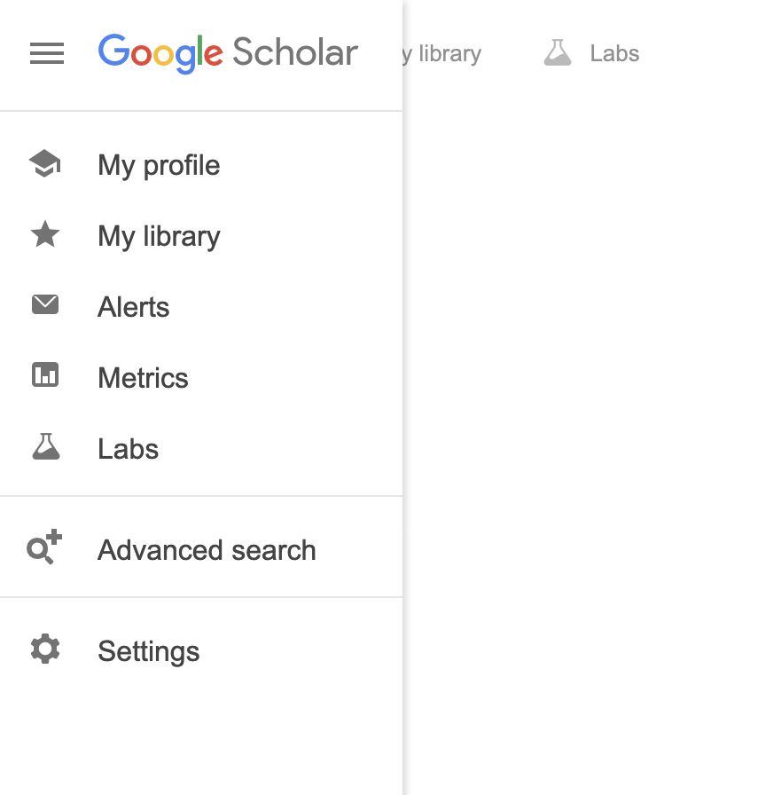
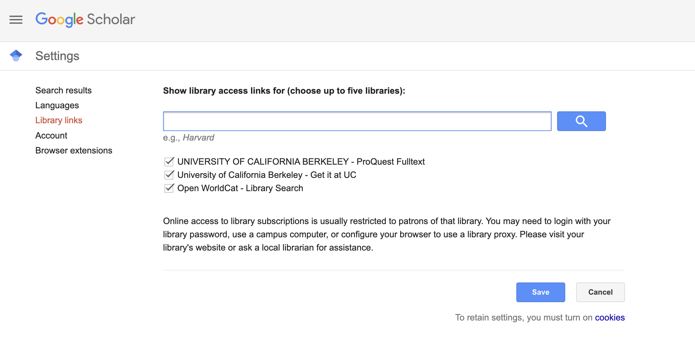
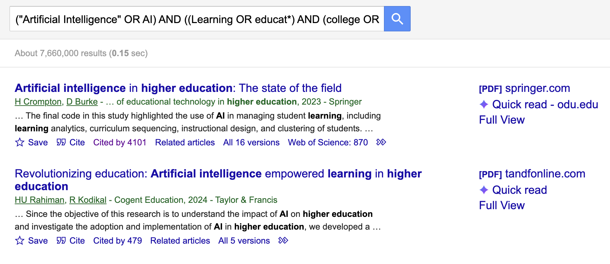
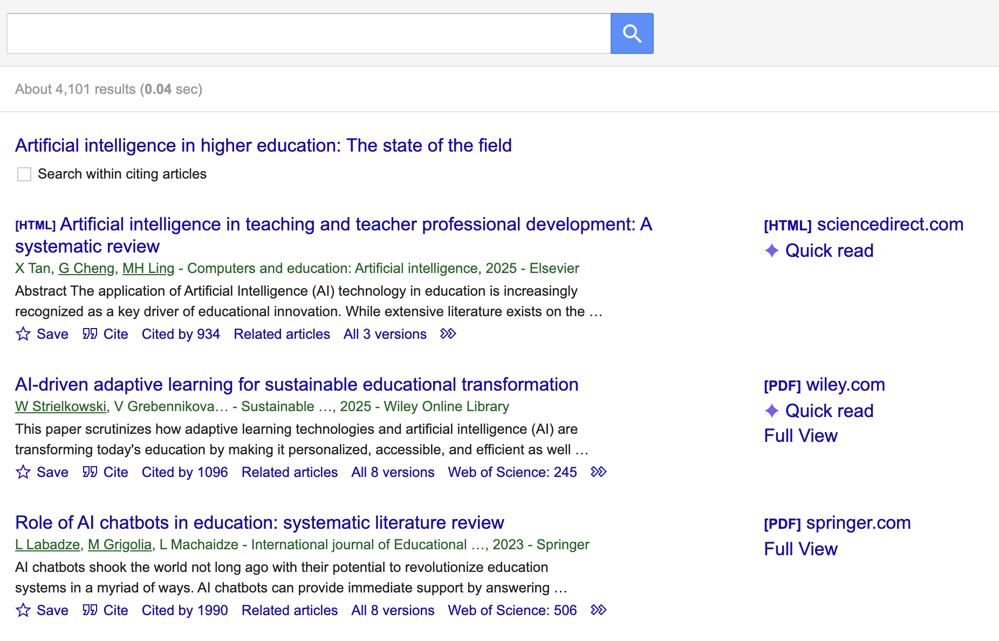
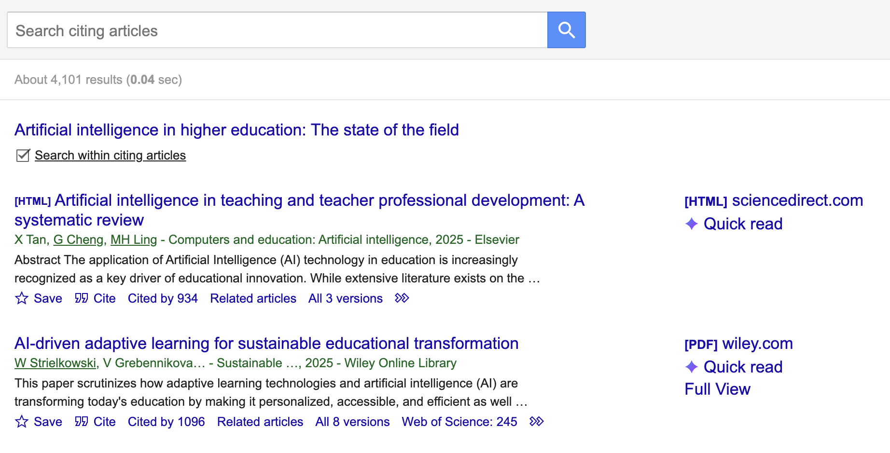
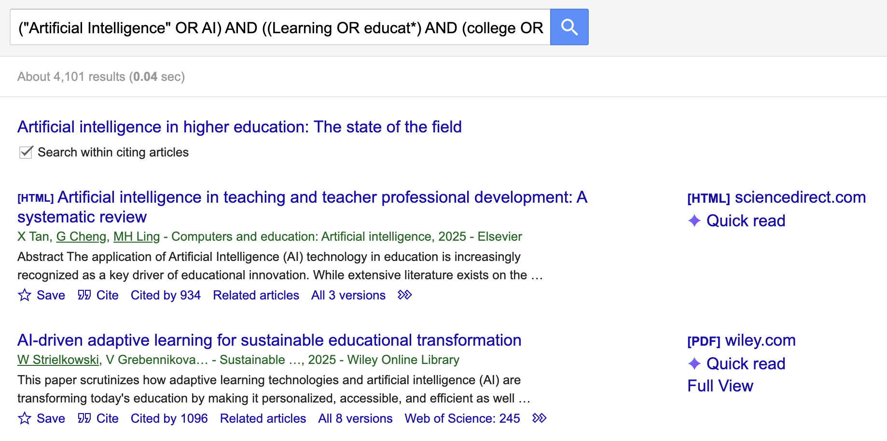
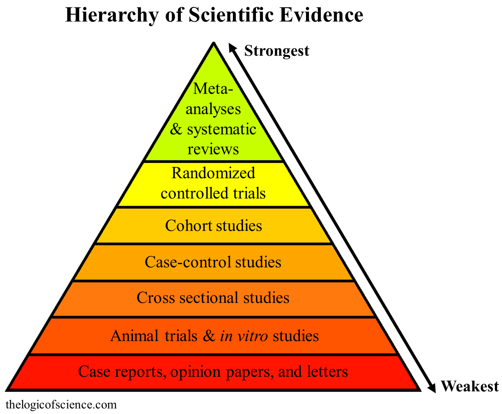

## Today's Icebreaker

- If you've met with your potential advisor(s), how has your original idea changed?
  - If you haven't met with them, what field of research are you thinking of looking at to match research from your potential advisor(s)?

- What are some keywords that come to mind when thinking about your research topic?

## JP's Response

- Additional focal points
  - No longer focused on intervention design and now focused on prediction
  - Thinking through pros and cons of interviews vs focus groups

- Keywords include:
  - Mathematics
  - Self-efficacy OR self efficacy
  - Grades
  - College OR university OR higher education
  - Cluster

## How to Look for Articles

- Use keywords

- Don't type out full statements

- Use forward & backward searches

- AI Options

## How to Look for Articles

- [Google Scholar](https://scholar.google.com/)

- Can use the [Berkeley Library website](https://www.lib.berkeley.edu/)

## Connect Google Scholar to UCB Library

{width="60%"}

## Connect Google Scholar to UCB Library

{width="60%"}

## Keywords

- Use `AND`, `OR`, `()`, `-`, `""`, `~`, `*`
  - Artificial Intelligence OR AI
  - Artificial Intelligence AND Learning
  - (Artificial Intelligence OR AI) AND Learning
  - (Artificial Intelligence OR AI) AND Learning AND -Deep (- = don't include)
  - ("Artificial Intelligence" OR AI) AND Learning AND -"Deep Learning" ("" = Look up exact term)
  - ("Artificial Intelligence" OR AI) AND (Learning OR ~education) AND -"Deep Learning" (~ = Look up synonyms)
  - ("Artificial Intelligence" OR AI) AND ((Learning OR educat*) AND (college OR university OR "higher education")) AND -"Deep Learning" (* = Any word with the same beginning)

## Keywords

- Sometimes your searches can sound problematic
  - Example: (Latina OR Latino OR Latinx OR Latine OR Hispanic OR *Mexican*)
  - Why not Latin*?

- [Resource here](https://library.acg.edu/how-to-guides/google-scholar/advanced-searching)

## Forward Searches

- You find an amazing article
  - Maybe it is too old
  - Has useful information

- Look at who cites that paper
  - Re-use your keywords in this new search

## Example of Forward Search

{width="60%"}

## Example of Forward Search

{width="60%"}

## Example of Forward Search

{width="60%"}

## Example of Forward Search

{width="60%"}

## Example of Forward Search

- Keep going

- Add filters on the left sidebar

- read abstracts to see what is useful

- Diversify authors
  - Don't just cite one group of authors
  - Looks like you didn't read enough literature

## Backward Searches

- While reading a useful article

- You find an interesting claim
  - Background information
  - Finding similar to the conclusion made in the current article
  - Check the references

- Look at the reference in Google Scholar
  - Can then forward search from this article

## AI Options

- [Consensus](conensus.app)

- [Elicit](https://elicit.com/solutions/search)

- Make sure to double check references

## Rules

- Seminal papers can be from any time
  - Usually someone has written about seminal papers to update them

- Empircal papers
  - Papers that run some form of analysis
  - Past ~10 years
    - Field dependent

- Understand the hierarchy of evidence when gathering literature

## Hierarchy of Evidence

{width="60%"}

## Types of References to Use

- Non-academic articles
  - Online research briefs (e.g., Pew Research Center)
  - Mainly used in hook of introduction

- Peer-reviewed articles/conference proceedings
  - Empirical research
  - Systematic Reviews/Scoping Reviews/Meta-Analyses

## Find Research Topic

- Central idea for your research

- Should be researched if
  - There is a gap in the literature
  - You have access to data that would answer the topic
  - Advances your academic career

## Point of the Lit Review

- Provides a framework showing importance of this research

- You build your argument with supporting or contradicting findings

- Helps solidify your research topic when identifying the gap(s) in the literature

## Literature Maps

- Map out how your literature will support your argument
  - Create categories to organize your paper into
  - Google [NotebookLM](https://sites.google.com/view/notebook-lm)

- Thinking like this can help with the writing process (when we get there)

## How to read articles

- If using AI, go ahead and use that for your initial search

- Read **abstracts only** the first time through

- Save articles you think may be useful

- Then you can read the articles

## Abstracts

- 

## Introduction

- 

## Methods

- 

## Results

- 

## Discussion/Conclusion

- 

## Future Studies/Limitations

- 

## Get an Article

- 

## Annotated Bibliographies

- Different philosophies of how to create annotated bibliographies
  - Short paragraphs with all information (~150 words)
    - Feels like another abstract

- Spreadsheets

## Example

- Make a copy or you could make something similar
  - [Link here for example spreadsheet](https://docs.google.com/spreadsheets/d/1plQjbtrMaPI9DM4vQAvvtYT2diX3pFjHXNdHUDxG0xE/edit?usp=sharing)

- If you would like to use a document instead
  - [Link here for example document](https://docs.google.com/document/d/13HKVF_CSMAKfT0NoHcd5H4DejZu19BxKZua_tgHF2Lo/edit?usp=sharing)
