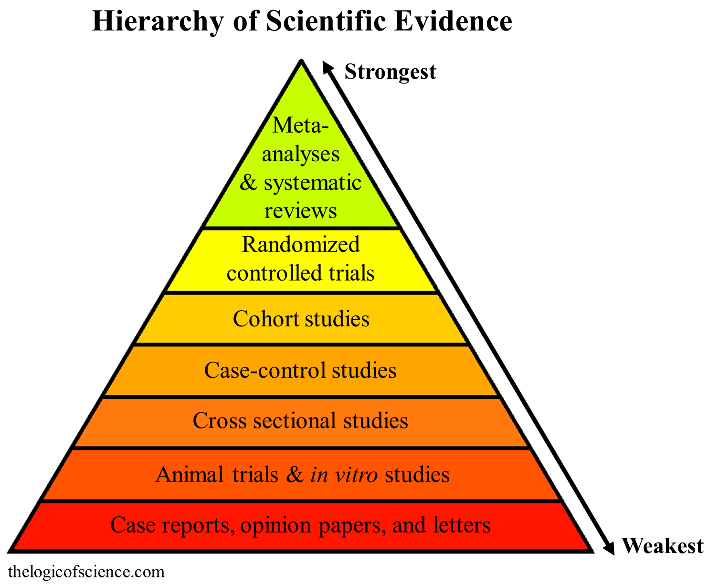
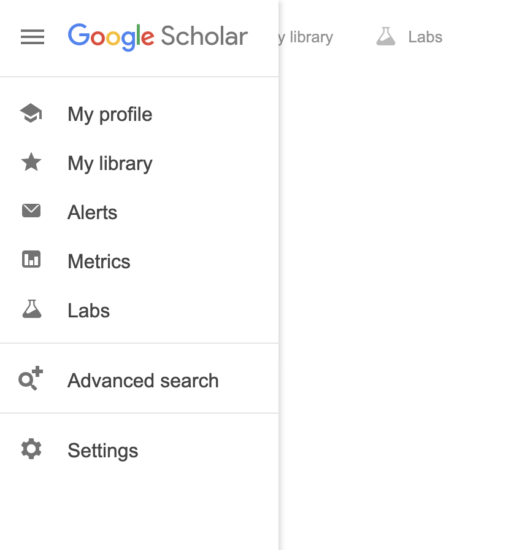
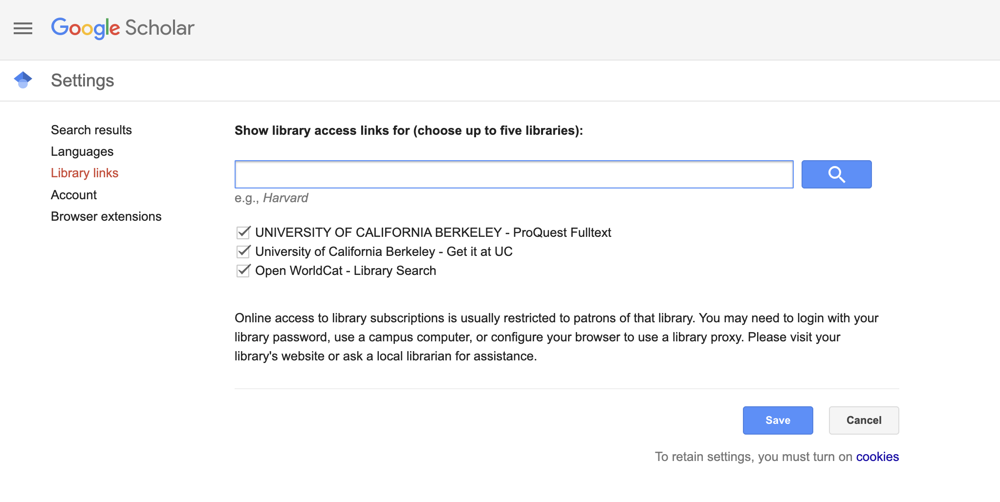
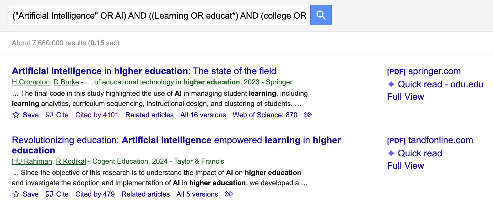
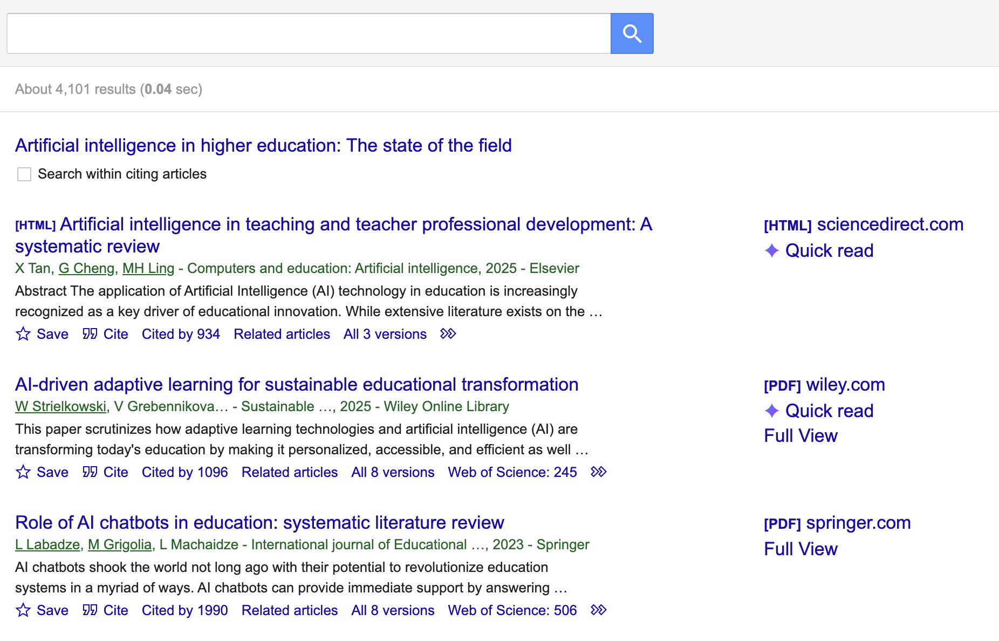
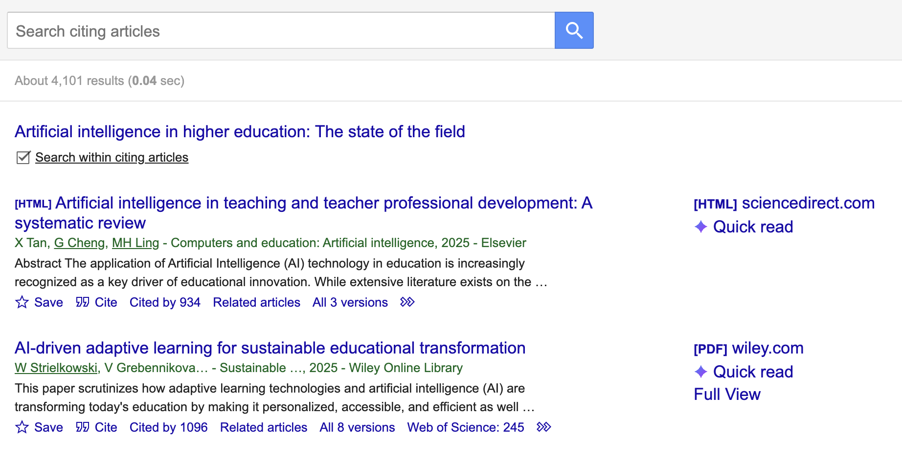
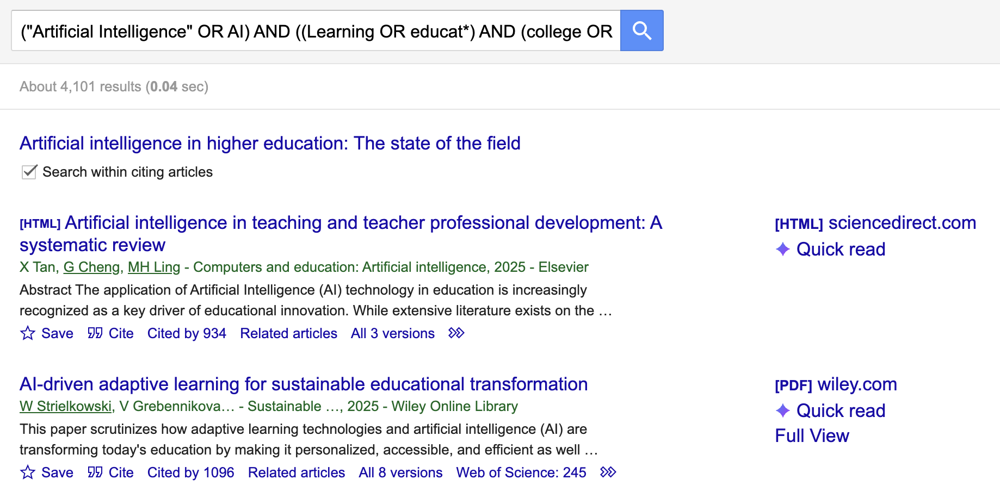

## Before our icebreaker

:::: {.columns}

::: {.column width="50%"}
- Can we just talk about the awesome job you all did giving short elevator pitches
- [Feedback survey](https://forms.gle/hA8WFV7E71GPd3ze6)
- [Slides from guest lecture can be found here](https://ucblib.link/DH2026)
- [Events from the library or related organizations](https://events.berkeley.edu/library/all/tags/Library%20Workshops)
:::

::: {.column width="50%"}
{width="60%"}
- [Photo by Samuel Phillips](https://www.pexels.com/photo/vibrant-concert-crowd-with-confetti-shower-30207418/)
:::

::::

## Today's Icebreaker

- If you've met with your potential advisor(s), how was your meeting? Has your original idea changed?
  
- If you haven't met with them, what field of research are you thinking of looking at to match research from your potential advisor(s)?

## JP's Response

- Additional focal points
  - No longer focused on intervention design and now focused on inferences for entire class
  - Thinking through pros and cons of interviews vs focus groups

## Announcement

- Would you rather have November 17th be the first round of final assignment presentations?
  - Thanksgiving week would be a check in + work on final written project
  - **All** final presentations would need to be submitted by **November 17th**

- Keep presentations for November 24th and have a lottery system for who gets to present on which day
  - You would have to be here for both presentation days because part of the assignment is giving feedback

## Rules

- Seminal papers can be from any time
  - Usually someone has written about seminal papers to update them

- Empirical papers
  - Papers that run some form of analysis
  - Past ~10 years
    - Field dependent

- Understand the hierarchy of evidence when gathering literature

## Hierarchy of Evidence

{width="60%"}

## Types of References to Use

- Non-academic articles
  - Online research briefs (e.g., Pew Research Center)
  - Mainly used in hook of introduction

- Peer-reviewed articles/conference proceedings
  - Empirical research
  - Systematic Reviews/Scoping Reviews/Meta-Analyses

## Find Research Topic

- Central idea for your research

- Should be researched if
  - There is a gap in the literature
  - You have access to data that would answer the topic
  - Advances your academic career

## Point of the Lit Review

- Provides a framework showing importance of this research

- You build your argument with supporting or contradicting findings

- Helps solidify your research topic when identifying the gap(s) in the literature

## Literature Maps

- Map out how your literature will support your argument
  - Create categories to organize your paper into
  - Google [NotebookLM](https://sites.google.com/view/notebook-lm)

- Thinking like this can help with the writing process (when we get there)

## How to read articles

- If using AI, go ahead and use that for your initial search

- Read **abstracts only** the first time through

- Save articles you think may be useful
  - Zotero

- Then you read the articles

## Example Article

- [Exploring Approaches for Estimating Parameters in Cognitive Diagnosis Models with Small Sample Sizes](https://www.mdpi.com/2624-8611/5/2/23)

- Use your own article if you want

## Abstracts

- Is this relevant?
  - No --> move on
  - Yes --> save to Zotero

## Introduction

- New topic = read
  - Citations may be helpful for developing research idea
  - Know about the topic --> ignore/skim
  - Look at the final paragraph in this section --> RQs/hypotheses/aims/purpose/etc.
- Contains theory

## Methods

- Very important (expect to add a lot here in annotated bibliographies)
- Contains protocol for data collection
- Cleaning methods
- Description of data
- Analytic Technique
- What the researchers did

## Results

- Main findings of the study
  - Dense ()
- I usually read it to get specifics
  - Actual estimation values

## Discussion/Conclusion

- Reports findings in clear terms
  - If something is interesting here THEN go to the results to understand more
- I write out main findings of the study in my annotated bibliographies

## Future Studies/Limitations

- Can find inspiration of how you might be able to expand on research that has been completed
- You can also take some of the future direction(s) and apply it to your work
  - If relevant

## If you haven't already, get an article

## Annotated Bibliographies

- Different philosophies of how to create annotated bibliographies
  - Short paragraphs with all information (~150 words)
    - Feels like another abstract

- Spreadsheets

## Example

- Make a copy or you could make something similar
  - [Link here for example spreadsheet](https://docs.google.com/spreadsheets/d/1plQjbtrMaPI9DM4vQAvvtYT2diX3pFjHXNdHUDxG0xE/edit?usp=sharing)

- If you would like to use a document instead
  - [Link here for example document](https://docs.google.com/document/d/13HKVF_CSMAKfT0NoHcd5H4DejZu19BxKZua_tgHF2Lo/edit?usp=sharing)

## Annotated Bibliographies Assignment

- Due Oct 4th at 11:59pm

- ~10 articles
  - No lower or upper cap
  - This is for you; you decide how many articles you need

## Try it out!

- Let's take ~15 minutes to start on annotated bibliographies

## Keywords

- What are some keywords that come to mind when thinking about your research topic?

- Keywords include:
  - Math*
  - ("Self-efficacy" OR "self efficacy")
  - Grade*
  - College OR university OR higher education
  - Cluster*
    - unsupervised
    - ((latent AND "mixture modeling") OR class OR profile)
    - Specific clustering alogorithms

## How to Look for Articles

- Use keywords

- Don't type out full statements

- Use forward & backward searches

- AI Options*

## AI Use

[Photo by Aleksandar Cvetanovic](https://www.pexels.com/photo/orange-cat-foot-on-laptop-keyboard-1440387/)

## How to Look for Articles

- [Google Scholar](https://scholar.google.com/)

- Can use the [Berkeley Library website](https://www.lib.berkeley.edu/)

## Connect Google Scholar to UCB Library

{width="60%"}

## Connect Google Scholar to UCB Library

{width="60%"}

## Keywords

- Use `AND`, `OR`, `()`, `-`, `""`, `~`, `*`
  - Artificial Intelligence OR AI
  - Artificial Intelligence AND Learning
  - (Artificial Intelligence OR AI) AND Learning
  - (Artificial Intelligence OR AI) AND Learning AND -Deep (- = don't include)
  - ("Artificial Intelligence" OR AI) AND Learning AND -"Deep Learning" ("" = Look up exact term)
  - ("Artificial Intelligence" OR AI) AND (Learning OR ~education) AND -"Deep Learning" (~ = Look up synonyms)
  - ("Artificial Intelligence" OR AI) AND ((Learning OR educat*) AND (college OR university OR "higher education")) AND -"Deep Learning" (* = Any word with the same beginning)

## Keywords

- Sometimes your searches can sound problematic
  - Example: (Latina OR Latino OR Latinx OR Latine OR Hispanic OR *Mexican*)
  - Why not Latin*?

- [Resource here](https://library.acg.edu/how-to-guides/google-scholar/advanced-searching)

## Forward Searches

- You find an amazing article
  - Maybe it is too old
  - Has useful information

- Look at who cites that paper
  - Re-use your keywords in this new search

## Example of Forward Search

{width="60%"}

## Example of Forward Search

{width="60%"}

## Example of Forward Search

{width="60%"}

## Example of Forward Search

{width="60%"}

## Example of Forward Search

- Keep going

- Add filters on the left sidebar

- read abstracts to see what is useful

- Diversify authors
  - Don't just cite one group of authors
  - Looks like you didn't read enough literature

## Backward Searches

- While reading a useful article

- You find an interesting claim
  - Background information
  - Finding similar to the conclusion made in the current article
  - Check the references

- Look at the reference in Google Scholar
  - Can then forward search from this article

## AI Options

- [Consensus](https://consensus.app/)

- [Elicit](https://elicit.com/solutions/search)

- Make sure to double check references