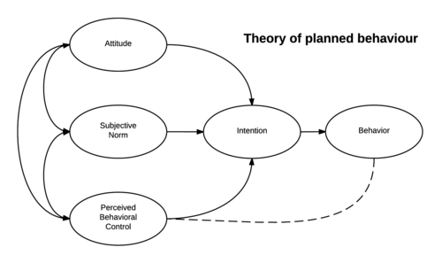
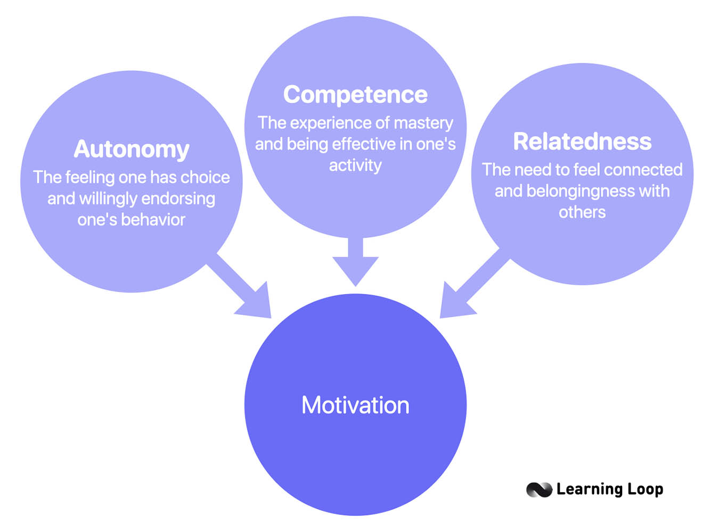
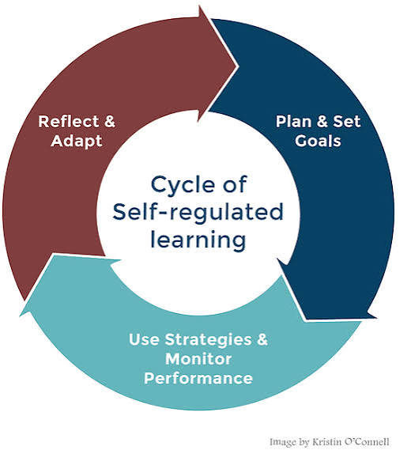
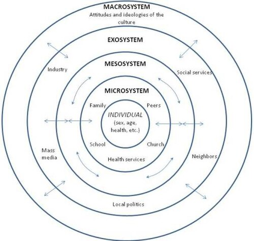
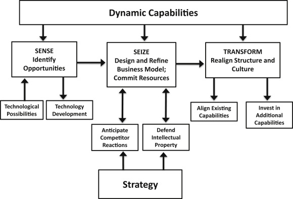

## Check ins

Let's chat about where you are at with finding an advisor, developing a research project, and annotated bibliographies

## Let's talk literature

- We focused on how to look for literature
- Let's now focus on how to read through literature
- Grab an article and follow along

## Abstracts

- Is this relevant?
  - No --> move on
  - Yes --> save to Zotero

## Introduction

- New topic = read
  - Citations may be helpful for developing research idea
  - Know about the topic --> ignore/skim
  - Look at the final paragraph in this section --> RQs/hypotheses/aims/purpose/etc.
- Contains theory

## Methods

- Very important (expect to add a lot here in annotated bibliographies)
- Contains protocol for data collection
- Cleaning methods
- Description of data
- Analytic Technique
- What the researchers did

## Results

- Main findings of the study
  - Dense
- I usually read it to get specifics
  - Actual estimation values

## Discussion/Conclusion

- Reports findings in clear terms
  - If something is interesting here THEN go to the results to understand more
- I write out main findings of the study in my annotated bibliographies

## Future Studies/Limitations

- Can find inspiration of how you might be able to expand on research that has been completed
- You can also take some of the future direction(s) and apply it to your work
  - If relevant

## Example Article

- [Exploring Approaches for Estimating Parameters in Cognitive Diagnosis Models with Small Sample Sizes](https://www.mdpi.com/2624-8611/5/2/23)
- Use your own article if you want

## If you haven't already, get an article

Let's spend 10 minutes reading your article and filling in some information for your annotated bibliography

## JP's Article - Intro

- Intro
  - Grab articles on estimation (section 1.2)
  - Purpose/Goal: "this study redounds to the line of work on the use of CDM in small samples [38] with the aim of concluding the best way to estimate item parameters"
  - Hypothesis: better performance of the different alternatives against MMLE-EM in situations of low sample size and no differences in situations of large sample size.
    - Hypothesis 1a: better performance of the different alternatives against MMLE-EM in situations of low sample size
    - Hypothesis 1b: no differences of different alternatives against MMLE-EM in situations of large sample size

## Methods

- Gold standard library for DCMs (GDINA) for MMLE-EM
  - MCMC using JAGS; compared to other acceptable programs
- Compared priors (look into priors for my work)
- More information on simulation study (should implement myself)
  - samples of 100 & 2000
  - 30 items & 5 skills
- Used well-known assessment dataset (not really empirical study; limitation to expand on in own work)

## Results

- Didn't bother reading yet

## Discussion

- MCMC performed better than MMLE-EM
- Restricted model did well on classification accuracy, reliability
  - Be cautious of using this model because it is very restrictive
  - Always compare to non-restricted model
- When working with larger data (N >= 1000), use MMLE-EM because it is faster and as accurate as MCMC
- Conclusion: For small samples use MCMC and/or restricted model

## Icebreaker

From the literature you have read, what is a potential research question you are thinking about? Draft a research question to share with your group.

## Research Questions (RQs), Hypotheses, Aims, Purpose???

- What your plan is for your research study
- RQs and hypotheses should be written before conducting analyses
  - This is good science
  - Good science != science
- Narrows your purpose statement
- Having RQs and/or hypotheses = good science
  - Should be testable

## Research Questions (RQs), Hypotheses, Aims, Purpose???

- RQs ask questions that you want answered
- Hypotheses are statements of what you hope to find
- Aims are exploratory ways of stating what you are interested in
- Purpose statements are what is the overarching reason you are conducting this study

## Example RQs

- Does student math self-efficacy improve by the end of the semester?
- What courses determine if students become accepted to be DS honors recipients?
- How do students learn using alternative course designs?

## RQs for Qualitative Analyses

- RQs are crucial in qualitative research
- Central questions on the broad phenomenon
  - Subquestions to narrow the focus of the study
- Central question should include your strategy for analysis
- Use "what" or "how" to create an open-ended question

## Qualitative RQ Template

(How or What) is the (“story for” for narrative research; “meaning of” the phenomenon for phenomenology; “theory that explains the process of ” for grounded theory; “issue” in the “case” for case study) of (phenomenon) for (participants) at (research site)?

## RQs for Quantitative (Inferential) Analyses

- Depends on the model
- Can focus on specific variables and relationships of interest?
- Depending on the analysis and design, can include causal language
  - Affect, cause, impact, etc.
- Can be more broad and followed by specific hypotheses
- Theory testing can be broad

## RQs for Quantitative Analyses

- Options include
  - What are the roles of features a-d in predicting y?
  - Is x related to y?
  - Does x cause y when accounting for z?
  - Are there differences in the relationship between x and y for z (groups)?
  - Does the theory of ______ support z (1 group)?

## RQs for Quantitative (Predictive) Analyses

- Can also be model specific
- Are there differences in model fit metrics when imputing data by mean, median, or multiple imputation?
- Is there a substantial difference in fit metrics comparing model A, model B, etc.?
  - What is the computational tradeoff of model A compared to model B in predicting ____?
- Does deleting non-significant features influence model accuracy?

## Hypotheses

:::: {.columns}

::: {.column width="60%"}
- "and" does not belong in a hypothesis EVER! 
  - "and" clearly indicates two parts of a hypothesis or two hypotheses

- Requirements
  - Can be tested
  - Does not include "and"
  - Wording must match your analysis(es) --> affect = causal language
  - Directionality 
:::

::: {.column width="40%"}

[Photo by Pixabay](https://www.pexels.com/photo/close-up-photo-of-crying-baby-47090/){width="60%"}
:::

::::

## More on RQs & Hypotheses

- Many times you don't need both
- Options
  - Broad RQ & specific hypothesis
  - Just RQs
  - Just hypotheses
  - Null hypothesis (don't declare), but change the language to be RQ
- Hypotheses are mainly for change
  - Also called alternative hypotheses
  - No change/effect = null hypothesis
  - As scientists we assume there is no change/difference/effect

## Best Practices

- Once you state your hypothesis and look at data there is no going back
  - Funding agencies now require authors to have RQs and/or hypotheses before starting analyses
  - The reality is that many academics don't follow this rule
  - Issue with publish or perish reality
    - No one wants to publish null findings --> reproducibility issue

## What is a theory/theoretical framework?

- Guiding your work
- Find within your literature
- May want a tab in your annotated bibliographies for theory/framework
- A large amount of literature supports a specific claim
  - Meta analyses/systematic reviews
- May come from different fields
- Don't make your own theory; you definitely don't have enough background information
- Don't name a theory after yourself

## Theory of Planned Behavior

{width="80%"}

## Self-Determination Theory

{width="80%"}

## Self Regulated Learning Theory

{width="80%"}

## Ecological Model

{width="80%"}

## Dynamic Capabilities Theory

{width="80%"}
