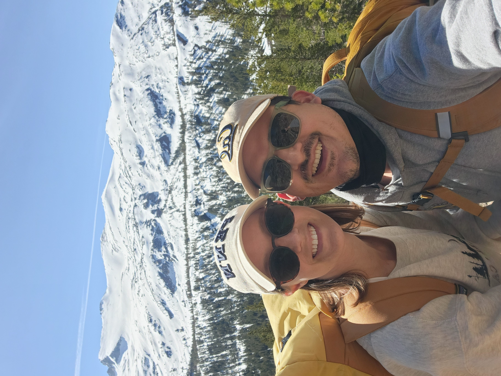
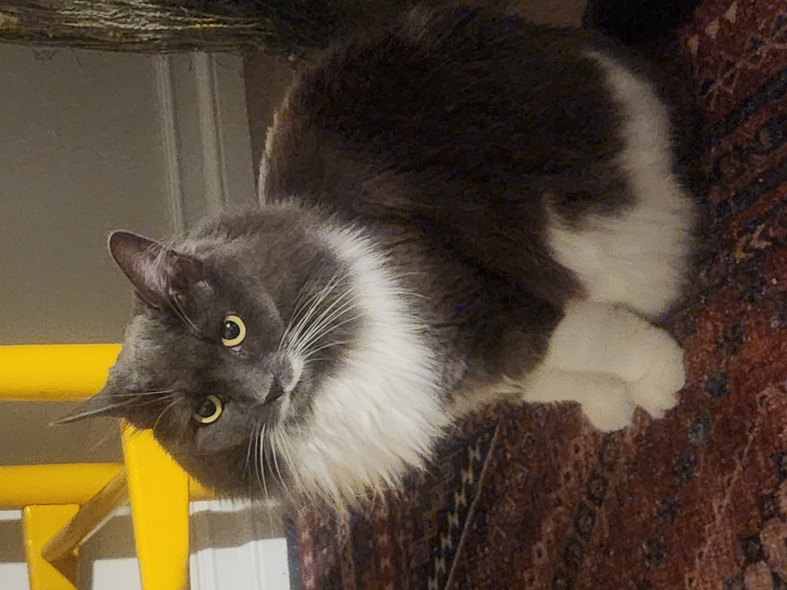
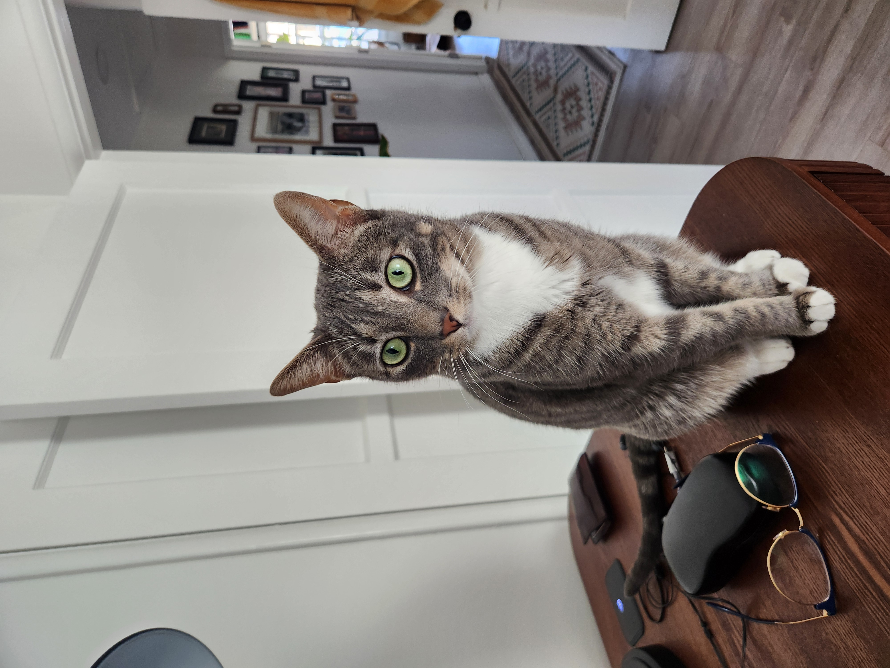

## Introduction

:::: {.columns}

::: {.column width="50%"}
- Dr. Jonathan A. Pedroza (JP; he/him)
  - Please call me JP
  - Everyone *only* gets one "professor/instructor/doctor Pedroza"

- I'm a first-generation college student
  - Only one in my family to get a PhD

- Inspiration: My undergraduate advisor, Dr. Alejandro Morales

- Hobbies: Roasting coffee, cooking, gardening, and fishing

- Useless skill: Can make myself cry on cue

:::

::: {.column width="50%"}
{height=300, width=400}
:::

::::

::: {.notes}
No one in my family still understands what I do.
:::

## Background

:::: {.columns}

::: {.column width="50%"}
- PhD in Prevention Science from University of Oregon
  - Identify as a Prevention Scientist

- My academic journey is a roller coaster
  - Cognition & neuroimaging
  - Latina/o/x health disparities
  - Adolescent substance use
  - Neighborhood composition
  - Educational assessments
  - Data Science education
:::

::: {.column width="50%"}
{height=200, width=250}
{height=200, width=250}
:::

::::

## Do you have the credentials to even teach this class?

- I've taught multiple courses
  - Statistics
  - Experimental research design
  - Seminar research group for McNair scholars

- Past experience as a data scientist for an educational research center
  - What was my most used skill?

- You all have awesome technical skills
  - Focus on:
    - Soft skills
    - Feasibility
    - Research skills

## Introductions

- What is your name? 
  - What are your pronouns?

- Where are you from?

- What is your domain emphasis?

- Tell us about someone who has been an inspiration to you.

- Tell us about a hobby or interest of yours.

- Tell us about a useless skill that you have.

- What are you most excited for in this class? What is most terrifying?

## Data H195 Format

- 2 semester sequence to conduct an independent data science project
  - Fall
    - Seminar on strengthing research skills
    - Building a relationship with an advisor
    - Getting access to data
      - Having feasible plans for project
  
  - Spring
    - Complete your thesis
      - Take project further
      - Have a letter writer/reference
      - Build your network

## What do I expect from you?

- Attendance
  - Come to class
  - Be ready to talk as a larger group and in smaller groups
  - Provide meaningful feedback for peers

- Be respectful and patient with one another

- Be ready to keep yourself on task for the assignments in this course
  - Plus whatever your advisor needs for your project
    - CITI training
    - Data collection techniques
    - New analytic techniques
    - Software

:::{.notes}
- Email me if you can't make it
- Bring questions about your project/advisor relationship
:::

# Let's get to the course

## **Independent** Projects

- What is needed of you
  - Hustle!
  - Keep yourself on task
  - Provide initiative
  
- Where I come in
  - Help with the research process
  - Accountability & deadlines
  - Outlines for work

## Course Components

- Finding an advisor

- Learn fundamentals of conducting research
  - Literature reviews
  - Research questions/hypotheses
  - Theory
  - Keeping yourself accountable (e.g., timelines)
  
- Additional skills
  - Accountability
  - Writing
  - Presenting
  - Reproducibility

## Generative AI Policy

- AI is allowed for
  - Brainstorming & idea generation
    - generate initial ideas
  - Coding assistance
  - Grammar checks

- AI is not allowed for
  - Generating any writing at all
  - Summarizing any reading, assignment, or instructions

## Assignments

- Assignments will help build parts of your project thesis

- Grading will be on bcourses

- Peer feedback for presentations

- You will do fine in this class as long as you are putting in effort and submitting assignments

- This course is not about the grade. It is about you learning how to conduct independent research

## Grade Breakdown

```{r}
#| label: grading-table

library(gt)

tibble::tribble(
  ~Assignment, ~`% of Grade`, ~Points,
  "In-class participation", "5%", 5,
  "Literature review/annotated bibliographies", "5%", 5,
  "Advisor check in", "5%", 5,
  "Timeline", "5%", 5,
  "Methodology proposal", "10%", 10,
  "Preliminary proposal presentation", "10%", 10,
  "Data documentation (e.g., GitHub, MaxQDA, Box)", "10%", 10,
  "Final proposal presentation", "20%", 20,
  "Final proposal", "30%", 30
) |>
  gt() |>
  cols_align(align = "left", columns = Assignment) |>
  cols_align(align = "center", columns = c(`% of Grade`, Points)) |>
  tab_options(table.width = pct(100))
```

## Annotated Bibliographies

- Read literature on your topic of interest

- Gather key information in either short paragraphs or spreadsheets
  - Purpose of the statement
  - Guiding theory
  - Research questions/hypotheses
  - Specific methods
  - Main findings

## Submit RQs/Hypotheses

- Develop RQs and/or hypotheses about your topic of interest
  - Guided by previous literature

- Focus will be on 
  - Whether the RQs are feasible in a year
  - If your data is capable of answering the RQs
  - If it aligns with your advisor's expertise

## Get RQs Approved

- Share your RQs with your advisor

- Get RQs approved over email
  - Submit screenshot of approval/conversation for credit

## Submit Timeline

- Breakdown of weekly activities

- Useful for keeping yourself accountable

- You will share this with your advisor
  - No need for any proof here

## Methodology Proposal

- You will write about your data
  - Your data source
    - Explanations of your sample
  - Steps of data manipulation, processing, and documentation (i.e., , missing data, cleaning)
  - How was data collected

- Analytic approches
  - Why specific models (literature backed)

- Metrics used and why

## Preliminary Proposal Presentation & Feedback

- Small group presentations
  - Presenting to others outside of your field

- You are all expected to give feedback to everyone in your group

## Create Repository for Data

- Depending on the type of data you have
  - You'll either use Box, a qualitative data service, or GitHub

## Final Proposal Presentation & Feedback

- Finalized presentation on your proposal that you will take with you into the spring semester

- You'll give feedback to every other student

## Final Proposal

- An accumulation of all of your work in the form of an academic paper


## Open Source Inspirations

- Relating to other courses in the data sequence

- Workflows

- Data Collecting

- Data Wrangling

- Data Analysis

- Data Reporting

  - Interactivity (i.e., notebooks)

  - Well documented (i.e., quarto reports)

  - Reproducibility & replicable


## Course Expectations

- **Peer review**: Provide feedback and engage with each others' projects

- **Assignments**: Series of assignments to build thesis elements

- **Engage with guest speakers**: Ask questions and apply to your projects

## Course Product


- 

## Attendance

- 

## Course Infrastructure

- 

## What is your thesis focused on?

- 


## Assignment 1

TODO
Preliminary Prospectus  ( 2 pages)  ( Week 4) 
The preliminary prospectus will be a chance to get started on identifying a research project. Elements will include the relationship to the students Domain Emphasis and techniques used in that domain. Students will describe data and methods that will be used.  

Advisor status
Confirmed
Requested not confirmed
Ideas for possible advisors.

## Assignment 2

Set up Github, reproducibility workflow  ( online)   ( Week 6) 
For those working with quantitative data, the reproducibility workflow will be set up with a github repo, a set of readmes and binder links, versions of datasets and output files. Documentation of code and the research process will be established as a set of best practices to be followed once the research project is underway. This framework for sharing code and results with a project partner or advisor will follow a rubric.  


## Assignment 3

Advisor Agreement  - Agreement from Advisor - plan for meetings


## Assignment 4

Data presentation proposal  (Jupyter Notebook)  ( Week 10)
For your research project, identify a data source and document its key aspects, including how the data was or will be collected (provenance), who owns it and any licensing restrictions on both the dataset and potential outputs, and the ways bias or censoring may affect its reliability or interpretation.

## Assignment 5

Methodology Proposal  ( 2 pages)  ( Week 12) 
Students should discuss the methodology proposed for their research project. How this methodology may fit in with domain emphasis can be explored. The intermediate steps of data manipulation and processing should be documented, and assumptions about errors and missing values should be recorded.  

 ## Assignment 6

Final Prospectus  - ( 6 pages, slide deck, github)  ( Week 14) 
The culmination of all these efforts will be a paper that summarizes and includes the information from the previous steps, and presents a tight proposal for the research project.  Accompanying the paper will be a slide deck for the oral presentation  and a github repository for the project work to be managed through.  Students will identify a project mentor and/or a project partner where appropriate.  

Present and Defend in group setting  - (oral)  ( Week 15)
Students will present and defend their project proposal in a group setting.   Peer students will offer feedback and identify clarifications.


